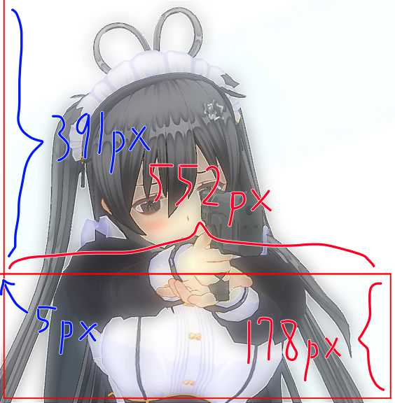
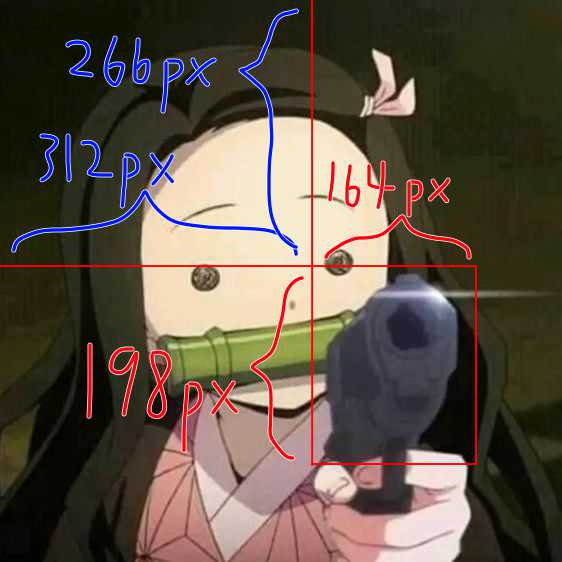
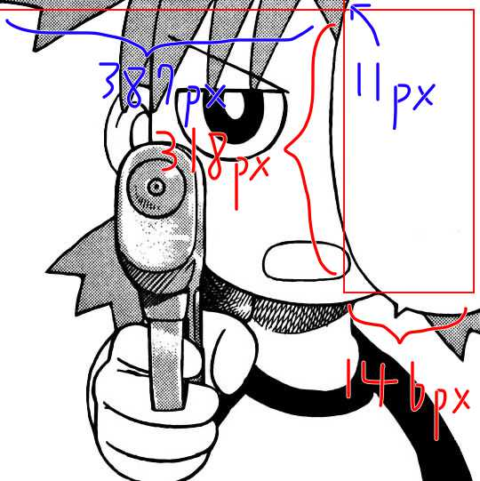

# Contributing
Feel free to add your own images to the database or re-map the text positions without asking. If your contribution is of other matters, please first discuss the change you wish to make via an issue. Thanks!

Please note we have a [code of conduct](https://github.com/ChingChang9/kurumi-tokisaki/blob/main/CODE_OF_CONDUCT.md). Please follow it in all your interactions with this project.

## Pull Request Process
1. Add the image(s) to `assets/images/` and make sure it follows the indexing.
  - Since this project is only used on Discord, 400x400 is enough. Any image with a width or height larger than 700px would be unnecessary. **Please scale it down**.
    - If you are on Mac, you can rescale an image easily by opening it in the built-in _Preview_ app → Tools → Adjust Size.
2. Add the text box position and size of each image you added in `assets/imageInfo.json` (see more about the text box position and size below).
  - If you are on Mac, you can get `maxWidth` and `maxHeight` by selecting an area in _Preview_, then get `x` and `y` by dragging the bottom right corner of the selection box to the top left corner of the image.
3. Increase the version number in `package.json` to a newer version. The versioning scheme we use is [SemVer](http://semver.org/) (if it's just image addition or text-reposition, increase the MINOR).
4. Give yourself a well-deserved headpat. We appreciate your contribution! 😊😊

### Text Box Position and Size
Here are three examples of where to put the text boxes, but feel free to get creative!

```json
"7": {
  "x": 5,
  "y": 391,
  "maxWidth": 552,
  "maxHeight": 178,
  "shadow": true
}
```


```json
"17": {
  "x": 312,
  "y": 266,
  "maxWidth": 164,
  "maxHeight": 198,
  "shadow": true
}
```


```json
"27": {
  "x": 387,
  "y": 11,
  "maxWidth": 146,
  "maxHeight": 318,
  "shadow": false
}
```
